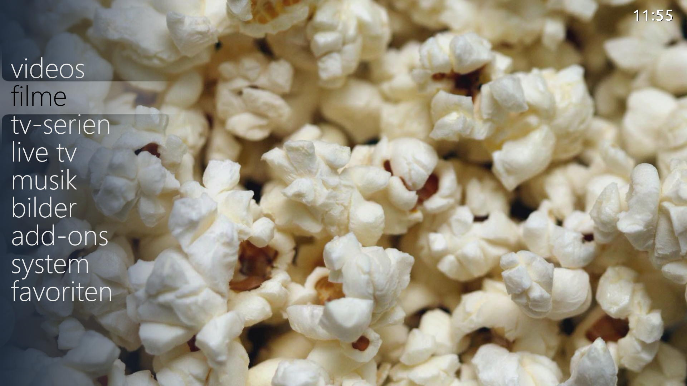

# reFocus light

> [Kodi](https://github.com/xbmc/xbmc) frontend skin optimized for low-power devices like the Raspberry Pi, originally based on reFocus Big

[Support Thread](https://forum.kodi.tv/showthread.php?tid=184160) on official Kodi.tv forums

## Install

1. Download my Kodi add-on repository: **[repo.disrupted](https://github.com/disrupted/repo.disrupted/releases)**
2. Within Kodi nagivate to Add-ons → Install from ZIP file → navigate to the previously downloaded **repo.disrupted**.zip and select
3. Install Skin from Repository
4. wait a few seconds for the download & installation process to complete, afterwards you will be prompted to switch to the newly installed skin

## Screenshots

